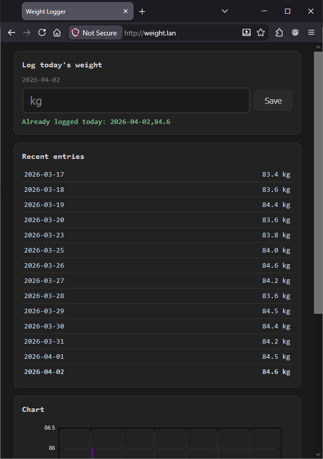

# Gnocchi

A simple, mobile first, golang web application allowing daily tracking of weight to markdown.

Very much intended for personal use, built to replace transcribing dates with paper and pen.
Expected to be used with [this file](https://github.com/breadcat/blog.minskio.co.uk/blob/master/content/weight.md) and [this script](https://github.com/breadcat/nix-configs/blob/main/scripts/blog-weight.nix), can also be run as a [NixOS service](https://github.com/breadcat/nix-configs/blob/main/common/roles/gnocchi.nix).


## Running

```
cd gnocchi
go run . -f /blog/weight.md -p 8080
```

Then access the servers IP address via a web browser on port `8080`.

## Screenshot


